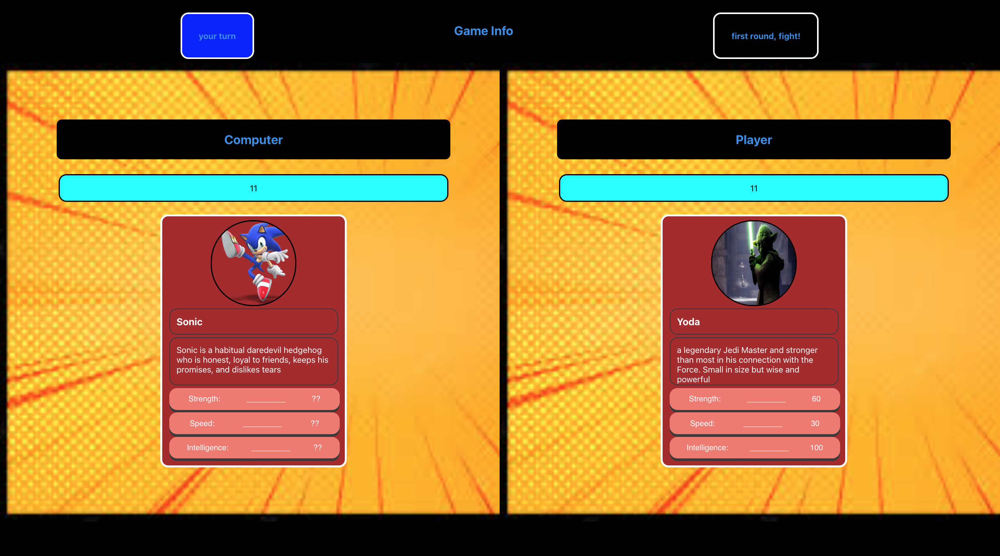

# TopTrumpsMMA

Welcome to the ultimate Top Trumps arena :boom: Mixed Martial Arts! :boom:
```
Where no character is out of the deck until they're knocked out ...well, collected...

The app is a simple game of Top Trumps with one twist - any character goes.
Super hero... pop star... hall of fame legend.. they're all here to help you battle it out to become the ultimate Top Trump champion! 

Play against the computer in a calculated battle of wits and fortune.

Good luck and watch out, the computer's fierce!
```

## Screenshots





### :wrench: This project was built by: 

- Eilidh Morrone  :link:  [https://github.com/SilenDt]

- Fraser Russell  :link:  [https://github.com/fraserr1991]

- Fraser Jubb  :link:  [https://github.com/fraserjubb]

- Sam Williams  :link:  [https://github.com/samuel-williams-ed]

Feb 2023, as part of a CodeClan (e62) project. 


# Getting Started with TopTrumpsMMA

This project is a browser based appliction (client) which relies on a locally hosted database to serve URL requests to athe browser. Both client and server sides are contained in this repo. To run the app you will need to run both the client and server. See the README in both client and server folders for instructions on how to do this. 

The client side of this project was bootstrapped with [Create React App](https://github.com/facebook/create-react-app).

The server side of this project relies on a [mongoDB] client (https://www.mongodb.com).


